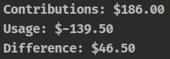

# UTA Farepay Card Usage

You'll be asked to select the card and the date range that you'd like to see the totals for. Keep in mind that UTA limits the transaction history even when you select the `All` option in the date range selector. 



## Installation

Make sure that the necessary system-level items are installed: 

* https://github.com/vifreefly/kimuraframework#installation

## Credentials

Create a file, `~/.uta/secrets.yml`, that has the following contents: 

```yaml
username: uta-username
password: uta-password
```

## Running

To run while also seeing the browser execute the actions: `HEADLESS=false ruby src/uta.rb`
